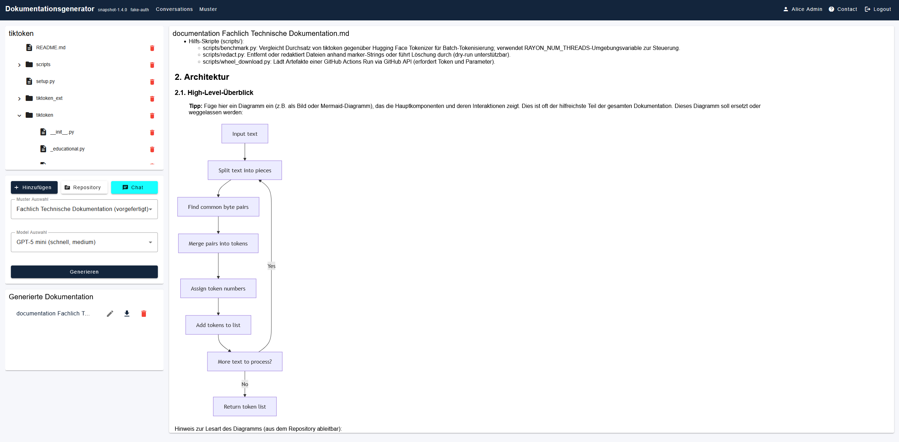

# Anwendung: Dokumentationsgenerator

Der Dokumentationsgenerator (auch genannt doc-gen oder DokuGen) ist eine Applikation, welche aus Dateien oder ganzen Repositories Dokumente erstellt. Es lassen sich fachlich technische Dokumentationen, Wiki Einträge und Code Kommentare generieren und für weitere Arten von Dokumenten können Muster angelegt werden, anhand welcher die Dokumente erstellt werden.<br>
Für eine Übersicht der Routen des Backends, siehe http://localhost:2320/dokumentationsgenerator_backend/docs nachdem das Backend gestartet worden ist.

Die App beinhaltet ein Angular Frontend und ein Python Backend, sowie eine SQLite Datenbank.



## Prerequesits

Ein GitHub Token und der richtige OpenAI API Key sind als Secret erforderlich.
Um die Anwendung lokal zu nutzen, müssen diese als Environment Variablen abgesetzt sein, wie z.B:

```bash
export OPENAI_API_KEY="..."
export GITHUB_TOKEN="..."
```

*Hinweis: Der GitHub Token ist nicht notwendig, kann aber zu Rate-Limit-Problemen führen, falls dieser nicht angegeben wird.*

## Starten des Backends

```bash
cd backend
pip install poetry
poetry lock
poetry install
poetry run start
```

## Starten des Frontends

```bash
cd frontend
npm install
npm run start
```

## 🧪 Anwendung testen

### Code-Qualität

**Code Qualität prüfen & automatische Bereinigung**

```bash
pip install black flake8
cd backend
flake8 .
black .
```

### Unit-Tests & Komponenten-Tests

```bash
cd backend
poetry run pytest
```

## Docker

```bash
docker build -t dokumentationsgenerator .
docker run -p 2320:2320 dokumentationsgenerator
```
