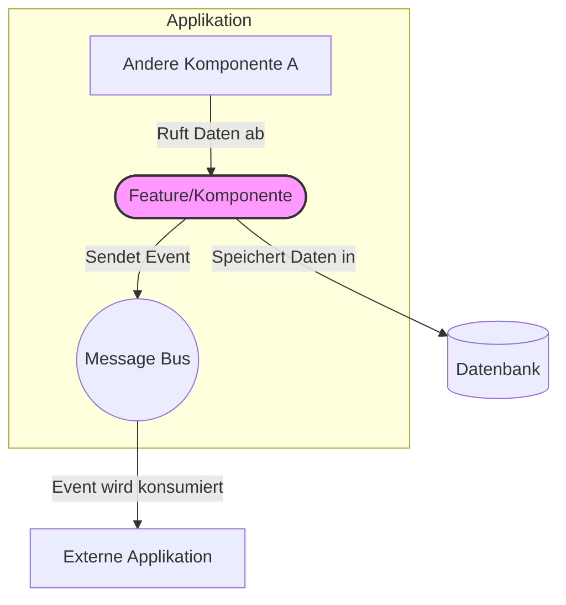

# `{{Feature/Komponentenname}}: Detaillierte Beschreibung`

<!-- Hinweise für den Ersteller dieses Dokuments: Alle hier im Muster genannten Daten sind fiktiv und müssen ersetzt werden bei der Erstellung. -->

| Attribut | Wert |
| --- | --- |
| **Hauptverantwortlich** | `{{Name des Entwicklers/Teams}}` |
| **Erstellt am** | `{{Datum}}` |
| **Letzte Änderung** | `{{Datum}}` |
| **Zugehörige Applikation** | `{{Applikationsname}}` |

 

<!--PROGRESS:Kapitel 0.1: Zusammenfassung-->
> ### Zusammenfassung (TL;DR)
> *   **Was ist das?** Eine kurze Ein-Satz-Beschreibung von `{{Feature/Komponentenname}}`.
> *   **Zweck:** Welches Kernproblem wird hier gelöst?
> *   **Wichtigste Interaktion:** Wie interagiert der Rest der Applikation oder ein Benutzer damit? (z.B. "Über den REST-Endpunkt `POST /orders`", "Durch das Empfangen von `UserCreated`-Events").

---

<!--PROGRESS:Kapitel 1: Zweck und Architektur-->
## 1. Zweck und fachlicher Kontext
Hier wird beschrieben, *warum* diese Komponente existiert.

*   **Problemstellung:** Welches spezifische geschäftliche oder technische Problem wird durch diese Funktionalität adressiert?
*   **Anforderungen:** Welche fachlichen Anforderungen (Business Requirements) liegen zugrunde? (z.B. "Benutzer müssen in der Lage sein, ihren Warenkorb für 30 Tage zu speichern.")
*   **Abgrenzung (Scope):** Was leistet diese Komponente bewusst *nicht*? Wo liegen die Grenzen ihrer Verantwortung?

<!--PROGRESS:Kapitel 2: Architektur-->
## 2. Architektur und Einordnung
Dieser Abschnitt zeigt, wie sich die Komponente in das Gesamtbild der Applikation einfügt.

> **Tipp:** Visualisierungen sind hier Gold wert! Ein einfaches Diagramm (z.B. mit Mermaid oder als Bild) kann mehr als tausend Worte sagen.

*   **Rolle im System:** Ist es ein Kernservice, ein Hilfsmodul, ein Adapter zu einem externen System?
*   **Abhängigkeiten:**
    *   **Eingehend (Abhängig von):** Von welchen anderen Modulen, Services oder Datenquellen ist diese Komponente abhängig?
    *   **Ausgehend (Abhängigkeiten zu):** Welche anderen Teile des Systems sind von *dieser* Komponente abhängig?

## 3. Detailliertes Design und Implementierung
Das ist das Herzstück des Artikels. Hier wird das "Wie" erklärt.

<!--PROGRESS:Kapitel 3.1: Kernlogik-->
### 3.1. Kernlogik / Prozessablauf
Beschreibe den schrittweisen Ablauf der Hauptfunktionalität.

1.  **Trigger:** Wodurch wird der Prozess gestartet? (z.B. API-Aufruf, eingehendes Event, zeitgesteuerter Job).
2.  **Validierung:** Welche Prüfungen werden zu Beginn durchgeführt?
3.  **Datenverarbeitung:** Welche Schritte der Datenmanipulation, Berechnung oder Anreicherung finden statt?
4.  **Persistenz:** Wie und wo werden Zustandsänderungen gespeichert?
5.  **Nebeneffekte (Side Effects):** Werden Events publiziert, andere Systeme aufgerufen oder Benachrichtigungen versendet?

<!--PROGRESS:Kapitel 3.2: Wichtige getroffene Design-Entscheidungen-->
### 3.2. Wichtige getroffene Design-Entscheidungen
Dieser Abschnitt ist entscheidend, um zukünftigen Entwicklern zu helfen, die Gründe für bestimmte Design-Entscheidungen zu verstehen ("Warum wurde es so und nicht anders gemacht?").

*   **Entscheidung A:** `{{z.B. Verwendung einer asynchronen Verarbeitung via Message Queue}}`
    *   **Begründung:** `{{z.B. Um die API-Antwortzeit zu verkürzen und die Resilienz gegenüber Ausfällen des externen Systems zu erhöhen.}}`
    *   **Alternativen (verworfen):** `{{z.B. Synchrone Verarbeitung. Wurde verworfen, da sie zu langen Wartezeiten für den Client geführt hätte.}}`
*   **Entscheidung B:** `{{z.B. Implementierung des Circuit Breaker Patterns}}`
    *   **Begründung:** `{{...}}`

<!--PROGRESS:Kapitel 3.3: Datenmodell-->
### 3.3. Datenmodell (falls zutreffend)
Eine Beschreibung der relevanten Datenstrukturen oder Datenbanktabellen.

*   **`{{Datenstruktur / Tabelle A}}`:**
    *   `id`: Primärschlüssel.
    *   `status`: Der Zustand des Objekts (mögliche Werte: `PENDING`, `COMPLETED`, `FAILED`).
    *   `payload`: Die eigentlichen Daten.

<!--PROGRESS:Kapitel 4: Schnittstellen und Interaktionen-->
## 4. Schnittstellen und Interaktionen (API)
Wie kommuniziert die Außenwelt mit dieser Komponente?

<strong>REST API Endpunkte</strong>

*   `POST /api/feature`
    *   **Zweck:** Startet den Prozess X.
    *   **Payload:** `{ "key": "value" }`
    *   **Antwort:** `202 Accepted`
*   `GET /api/feature/{id}`
    *   **Zweck:** Ruft den Status von Prozess X ab.
    *   **Antwort:** `{ "id": "...", "status": "COMPLETED" }`

<strong>Konsumierte Events</strong>

*   **Event:** `UserSignedUpEvent`
    *   **Quelle:** `{z.B. Identity Service}`
    *   **Aktion:** Erstellt ein initiales Benutzerprofil in der lokalen Datenbank.

<strong>Publizierte Events</strong>

*   **Event:** `FeatureCompletedEvent`
    *   **Zweck:** Informiert andere Teile des Systems, dass der Prozess erfolgreich abgeschlossen wurde.
    *   **Payload:** `{ "featureId": "...", "result": "..." }`

<!--PROGRESS:Kapitel 5: Konfiguration-->
## 5. Konfiguration
Wie kann das Verhalten der Komponente zur Laufzeit angepasst werden, ohne Code zu ändern?

| Umgebungsvariable | Beschreibung | Standardwert |
| --- | --- | --- |
| `FEATURE_TIMEOUT_MS` | Timeout in Millisekunden für den Aufruf von System X. | `5000` |
| `FEATURE_RETRIES` | Anzahl der Wiederholungsversuche bei einem Fehler. | `3` |
| `FEATURE_FLAG_NEW_LOGIC` | Aktiviert/Deaktiviert die neue Berechnungslogik. | `false` |

<!--PROGRESS:Kapitel 6: Fehlerbehandlung und Monitoring-->
## 6. Fehlerbehandlung und Monitoring
*   **Typische Fehlerfälle:** Welche bekannten Fehler können auftreten und wie reagiert die Komponente darauf? (z.B. "Wenn das externe System nicht erreichbar ist, wird der Prozess nach 3 Versuchen in den `FAILED`-Status versetzt.")
*   **Logging:** Welche wichtigen Informationen werden geloggt, um bei der Fehlersuche zu helfen? Gibt es spezifische Log-Marker?
*   **Metriken:** Welche Metriken werden bereitgestellt, um die Gesundheit und Leistung zu überwachen? (z.B. `feature_process_duration_seconds`, `feature_failures_total`).
